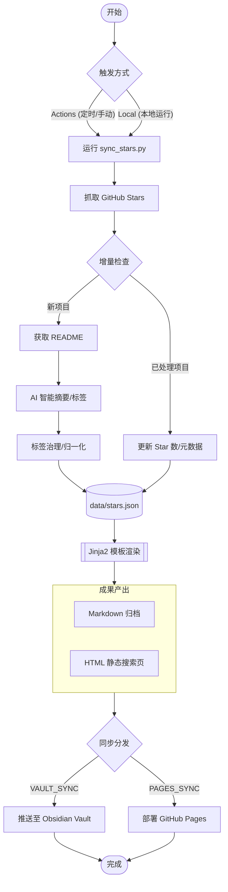

# GitHub Stars Index

> 自动抓取 GitHub Stars，生成 AI 摘要，便于检索。

## 目录

- [功能特性](#功能特性)
- [快速开始](#快速开始)
- [配置项详解](#配置项详解-环境变量--env)
- [Obsidian 同步（可选）](#obsidian-同步可选)
- [本地运行](#本地运行)

---

## 功能特性

- 🤖 自动抓取 GitHub 账号 Star 的全部仓库
- 📝 为每个仓库读取 README，调用 AI 生成内容摘要和技术标签
- 🏷️ **标签智能治理**：内置 `TAG_MAPPING` 映射库，自动合并同义词、归一化技术栈（如 LLM -> AI 大模型），拒绝标签爆炸（可能效果也不好）
- ⚡️ **高效率**：支持**并发调用** AI 接口，大幅提升处理大量新项目时的速度
- 🗃️ **数据驱动**：所有信息存储为 `data/stars.json`，支持二次开发
- 🎨 **模版驱动**：使用 Jinja2 模版生成 Markdown 和 HTML 静态页面
- ⏭️ **智能增量**：新项目调用 AI 总结，旧项目**自动同步最新的 Star 数和元数据**
- ⏰ GitHub Actions **定时自动运行**，cron 表达式自由配置
- 🔄 可选：自动将生成的 `stars_zh.md` & `stars_en.md` **推送到 Obsidian Vault 仓库**
- 🌐 可选：自动同步到 **GitHub Pages** 分支，支持多语言 (ZH/EN) 切换与页面实时搜索
- 💻 支持任意 **OpenAI 格式兼容接口**（OpenAI / Azure / 本地 Ollama 等）

---

## 流程概览



---


## 快速开始

### 第一步：Fork 本仓库

点击右上角 **Fork**，将本仓库复制到你自己的账号下。

### 第二步：配置环境 (二选一)

本项目通过环境变量驱动，**配置优先级：GitHub Secrets > .env 文件**。

#### 方案 A：使用 GitHub 环境变量 (推荐，适合持续运行)

进入仓库的 **Settings → Secrets and variables → Actions** 进行配置：

**🔐 必填项 (Required Secrets/Variables)**
- `GH_USERNAME`: 要抓取 Stars 的 GitHub 用户名。
- `AI_API_KEY`: 你的 AI 接口 API Key。

**📋 可选项 (Optional Variables)**
以下参数有内置默认值，通常无需配置：
- `AI_BASE_URL`: AI 接口地址 (默认使用 OpenAI 官方地址)。
- `AI_MODEL`: 模型名称 (默认 `gpt-4o-mini`)。
- `OUTPUT_FILENAME`: 生成文件的基准名 (默认 `stars`)。
- `VAULT_SYNC_PATH`: Vault 里的存放目录 (默认 `GitHub-Stars/`)。
- `PAGES_SYNC_ENABLED`: 是否同步到 Pages (默认 `true`)。

> [!TIP]
> **关于 GitHub API 限制**：
> - **线上运行 (Actions)**：工作流会自动注入 `GITHUB_TOKEN`，额度高达 1,000次/小时，抓取全量 Stars 无压力。
> - **本地运行**：若不配置 `GH_TOKEN`，API 限制为 60次/小时。若 Stars 较多，建议在 `.env` 中填入 `GH_TOKEN` 以提升额度至 5,000次/小时。

#### 方案 B：使用 .env 文件 (适合本地开发)

1. 在仓库根目录，复制 `.env.example` 并重命名为 `.env`。
2. 在 `.env` 中填入必填项。

---

### 第三步：自定义定时频率

编辑 `.github/workflows/sync.yml`，修改 `cron` 表达式：

```yaml
schedule:
  - cron: "0 2 * * 1"  # 示例：每周一凌晨 2 点运行
```

### 第四步：手动触发首次运行

进入 **Actions → 🌟 GitHub Stars Index同步 → Run workflow**，点击运行。

---

## 配置项详解

| 变量名               | 类型     | 说明                       | 默认值                      |
| -------------------- | -------- | -------------------------- | --------------------------- |
| `GH_USERNAME`        | 必填     | 要同步的 GitHub 用户名     | -                           |
| `AI_API_KEY`         | 必填     | AI 接口 Key                | -                           |
| `AI_BASE_URL`        | 可选     | OpenAI 兼容接口地址        | `https://api.openai.com/v1` |
| `AI_MODEL`           | 可选     | 使用的 AI 模型             | `gpt-4o-mini`               |
| `OUTPUT_FILENAME`    | 可选     | 生成 MD/HTML 的文件名基准  | `stars`                     |
| `VAULT_SYNC_ENABLED` | 可选     | 是否开启 Obsidian 同步     | `false`                     |
| `VAULT_REPO`         | 选填     | Vault 仓库 (`owner/repo`)  | -                           |
| `VAULT_SYNC_PATH`    | 可选     | Vault 同步的目录路径       | `GitHub-Stars/`             |
| `PAGES_SYNC_ENABLED` | 可选     | 是否开启 GitHub Pages 部署 | `true`                      |
| `MAX_CONCURRENCY`    | 可选     | AI 并发处理数 (建议 1-10)  | `1`                         |
| `GH_TOKEN`           | **建议** | 提升 API 额度，防止限速    | -                           |

---

## Obsidian 同步（可选）

该功能允许你将生成的 Stars 汇总自动推送到你的 Obsidian Vault (或任何其他) GitHub 仓库中，实现笔记软件内的自动更新。

### 核心机制
**本质是跨仓库自动同步**：许多 Obsidian 用户使用 GitHub 仓库来存储和同步笔记。本项目通过 GitHub API，将生成的 Markdown 文件直接推送到你指定的另一个仓库中（你的 Vault 仓库）。

### 配置步骤

1.  **准备目标仓库**: 确保你的 Obsidian Vault 已经托管在 GitHub 上。
2.  **创建权限 Token (PAT)**:
    - 访问 [Fine-grained PAT 配置页](https://github.com/settings/personal-access-tokens)。
    - **Repository access**: 选择 "Only select repositories"，并选中你的 **Vault 仓库**。
    - **Permissions**: 在 "Repository permissions" 中，设置 **Contents** 为 **Read and write**。
    - 生成 Token 后，将其存入本项目的 **Settings -> Secrets -> Actions** 中，命名为 `VAULT_PAT`。
3.  **开启同步配置**:
    - 在本项目的 **Settings -> Variables -> Actions** 中：
        - 设置 `VAULT_SYNC_ENABLED` 为 `true`。
        - 设置 `VAULT_REPO` 为 `你的用户名/仓库名` (例如 `iblogc/my-obsidian-vault`)。
        - 设置 `VAULT_SYNC_PATH` 为你希望在 Vault 中存放的目录 (例如 `Reading/GitHub-Stars/`)。
4.  **保存完成**: 下次 Action 运行时，生成的 `stars_zh.md` 和 `stars_en.md` 将会自动出现在你的 Vault 仓库中。

> [!TIP]
> **本地如何查收？**
> 远程同步完成后，你只需在本地 Obsidian 中使用 **Obsidian Git** 插件执行拉取 (Pull)，或者手动在仓库目录下 `git pull`，最新的 Stars 摘要就会出现在你的笔记库中了。

---

## GitHub Pages 部署（可选）

本项目自动生成支持多语言、支持实时搜索的静态网页：

1. 确保 `PAGES_SYNC_ENABLED=true`。
2. 运行一次 Action 后，进入 **Settings -> Pages**。
3. **Branch** 选择 `gh-pages`，目录选择 `/(root)`，保存。

---

## Docker 部署

如果你希望在服务器上长期运行并自动同步，推荐使用 Docker Compose。

### 1. 准备配置
复制 `.env.example` 为 `.env` 并填写必要信息：
```bash
cp .env.example .env
# 编辑 .env 填入 GH_USERNAME、AI_API_KEY 和 GH_TOKEN
```

> [!IMPORTANT]
> **必须填写 GH_TOKEN**：在 Docker 环境中请求 GitHub API 极易触发 [Rate Limit](https://docs.github.com/en/rest/using-the-rest-api/rate-limits-for-the-rest-api)。如果不配置 `GH_TOKEN`，API 限制为 60次/小时，抓取稍多 Stars 就会报错。配置后限额提升至 5,000次/小时。

### 2. 启动服务
使用 Docker Compose 一键启动：
```bash
docker compose up -d
```
该命令会启动两个容器：
- `sync`: 核心同步脚本。默认每 **24 小时** 自动抓取并生成一次。你可以在 `.env` 中设置 `SCHEDULE_HOURS` 来调整间隔。
- `web`: 基于 Nginx 的静态服务器，用于展示生成的索引页面。

### 3. 访问页面
打开浏览器访问：`http://localhost:8080`

### 4. 常用管理命令
```bash
# 查看同步日志
docker logs -f github-stars-sync

# 立即执行一次强制同步（不等待周期）
docker compose run --rm sync

# 仅更新页面渲染（不调用 AI）
docker compose run --rm sync --render-only
```

---

## 本地运行

```bash
# 克隆仓库并安装依赖
git clone https://github.com/iblogc/GithubStarsIndex.git
cd GithubStarsIndex

# 安装依赖
pip install -r requirements.txt
# 或者使用 uv (推荐)
uv pip install -r requirements.txt

# 使用 .env 进行配置
cp .env.example .env
# 编辑 .env 填入 AI_API_KEY 和 GH_USERNAME

# [常规运行] 获取原信息、调用 AI 总结并渲染页面
python scripts/sync_stars.py
# 或者
uv run scripts/sync_stars.py

# [仅渲染模式] 跳过抓取和 AI 总结，仅依据本地 stars.json 极速重新渲染 HTML/MD
python scripts/sync_stars.py --render-only
```

---

## 文件说明

| 文件                         | 说明                                 |
| :--------------------------- | :----------------------------------- |
| `data/stars.json`            | **核心数据集**（抓取的全量项目数据） |
| `templates/`                 | Jinja2 生成模版（Markdown/HTML）     |
| `dist/`                      | 自动生成的本地成品（HTML / MD）      |
| `scripts/sync_stars.py`      | 核心同步与生成脚本                   |
| `.github/workflows/sync.yml` | GitHub Actions 定时工作流            |
| `.env.example`               | 配置示例文件                         |

---

## 附录：申请 GitHub Token (GH_TOKEN)

为了保证程序能够顺畅抓取你的全部 Stars，建议申请一个具有只读权限的人员访问令牌（Personal Access Token）。

### 申请步骤：
1.  访问 [GitHub Fine-grained PAT 页面](https://github.com/settings/personal-access-tokens/new)。
2.  **Token name**: 填写 `Stars-Index-Sync` (或任意你喜欢的名字)。
3.  **Expiration**: 建议选择 `90 days` 或 `Custom`。
4.  **Resource owner**: 选择你的个人账号。
5.  **Repository access**: 选择 `Public Repositories (read-only)` 即可，或者选 `All repositories`。
6.  **Permissions**: 无需额外特殊权限，默认的公共访问权限已足够抓取 Stars 列表。
7.  点击 **Generate token**，**立即复制并保存**该 Token。
8.  将此 Token 填入 `.env` 文件的 `GH_TOKEN` 字段中。

> [!TIP]
> 如果你也开启了 **Obsidian 同步 (Vault Sync)**，可以直接复用具有写入权限的 `VAULT_PAT` 作为 `GH_TOKEN`。

