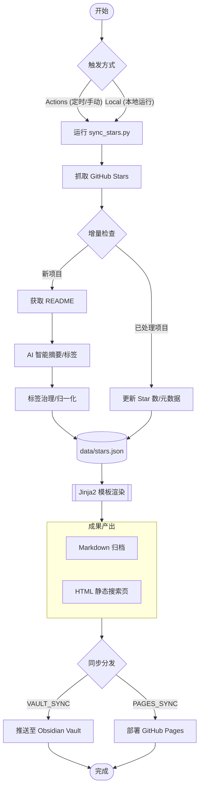

# GitHub Stars Index

[English](README.en.md) | 中文

> 自动抓取 GitHub Stars，生成 AI 摘要，便于检索。

## 目录

- [功能特性](#功能特性)
- [快速开始](#快速开始)
- [Stars Atlas（数据网格）](#stars-atlas数据网格)
- [给 Agent 调用（无需服务端）](#给-agent-调用无需服务端)
- [RSS 订阅](#rss-订阅)
- [配置项详解](#配置项详解-环境变量--env)
- [Obsidian 同步（可选）](#obsidian-同步可选)
- [本地运行](#本地运行)

---

## 功能特性

- 🤖 自动抓取 GitHub 账号 Star 的全部仓库
- 📝 为每个仓库读取 README，调用 AI 生成内容摘要和技术标签
- 🏷️ **标签智能治理**：内置 `TAG_MAPPING` 映射库，自动合并同义词、归一化技术栈（如 LLM -> AI 大模型），拒绝标签爆炸（可能效果也不好）
- ⚡️ **高效率**：支持**并发调用** AI 接口，大幅提升处理大量新项目时的速度
- 🗃️ **数据驱动**：运行时使用 `data/stars.json`，发布到 `gh-pages/data/stars.json`，支持二次开发
- 🎨 **模版驱动**：使用 Jinja2 模版生成 Markdown 和 HTML 静态页面
- ⏭️ **智能增量**：新项目调用 AI 总结，旧项目**自动同步最新的 Star 数和元数据**
- ⏰ GitHub Actions **定时自动运行**，cron 表达式自由配置
- 🔄 可选：自动将生成的 `stars_zh.md` & `stars_en.md` **推送到 Obsidian Vault 仓库**
- 🌐 可选：自动同步到 **GitHub Pages** 分支，支持多语言 (ZH/EN) 切换与页面实时搜索
- 💻 支持任意 **OpenAI 格式兼容接口**（OpenAI / Azure / 本地 Ollama 等）
- 🗺️ **Stars Atlas 数据网格（子页面）**：`/` 仍是原来的浏览主页，另在 `atlas/` 生成一个**更快检索**的子页面 —— 用**纯规则引擎**（零 AI、零额外密钥）把仓库分成 **16 个领域 / 85 个子类 / 100+ 标签**，以「左侧分面筛选 + 高密度可排序表格 + 右侧详情」的主从视图呈现（筛选维度含领域、语言、AI 标签、形态、收藏年份、创建年份、星数），带分面计数、无限滚动、键盘导航、可分享 URL 与中英双语/明暗主题
- 🤖 **可被 Agent 调用**：发布静态数据接口（按领域/主题切好的分片 + JSONL 语料），并附带**零依赖 MCP 服务器**，让 Agent 在别的活里直接检索、推荐、取档案
- 📡 **RSS 订阅**：全站与分领域订阅源，按收藏时间倒序

---

## 流程概览


```mermaid
graph TD
    Start([开始]) --> Trigger{触发方式}
    Trigger -- "Actions (定时/手动)" --> Sync[运行 sync_stars.py]
    Trigger -- "Local (本地运行)" --> Sync
    
    Sync --> FetchGH[抓取 GitHub Stars]
    FetchGH --> Filter{增量检查}
    Filter -- "已处理项目" --> UpdateMeta[更新 Star 数/元数据]
    Filter -- "新项目" --> FetchRD[获取 README]
    
    FetchRD --> AI[AI 智能摘要/标签]
    AI --> Norm[标签治理/归一化]
    Norm --> Store[(data/stars.json)]
    UpdateMeta --> Store
    Store --> Render
    
    Render[[Jinja2 模板渲染]] --> Output
    
    subgraph Output [成果产出]
        MD[Markdown 归档]
        HTML[HTML 静态搜索页]
    end
    
    Output --> Dispatch{同步分发}
    Dispatch -- "VAULT_SYNC" --> Obs[推送至 Obsidian Vault]
    Dispatch -- "PAGES_SYNC" --> Pages[部署 GitHub Pages]
    
    Obs --> End([完成])
    Pages --> End
```

---


## 快速开始

### 第一步：Fork 本仓库

点击右上角 **Fork**，将本仓库复制到你自己的账号下。

> [!IMPORTANT]
> 本站模板已内置 `analytics.1step.dev` 网站分析脚本，默认 `data-website-id` 为 `GitHubStarsIndex`。
> 为避免统计数据混入原项目仪表板，Fork 后请改成你自己的站点 ID。
>
> 脚本只在 **`templates/analytics.html.j2`** 一处维护，所有 HTML 页面（`/` 与 `/atlas/`）都通过
> `` 引入 —— 改一处即全站生效。
>
> **不配置也能用**：默认注入 `data-website-id="GitHubStarsIndex"`，两个页面都带。
> 想在 GitHub Actions 里改，用下面这几个 **Variables**（工作流已透传，留空即用默认值）：
>
> | Variable | 默认值 | 作用 |
> | :--- | :--- | :--- |
> | `ANALYTICS_WEBSITE_ID` | `GitHubStarsIndex` | 网站 ID，Fork 后改成自己的 |
> | `ANALYTICS_ENABLED` | 开启 | 设 `false` 即整段不注入脚本 |
> | `ANALYTICS_SRC` | `analytics.1step.dev/tracker.min.js` | 自定义脚本地址 |
>
> 留空会被当成「未配置」并回落到默认值（GitHub 对未设置的 Variable 渲染出的就是空串）。
>
> 注：`stars_zh.md` / `stars_en.md` 是 Markdown 归档，不含 JS 运行环境，无法统计。

### 第二步：配置环境 (二选一)

本项目通过环境变量驱动，**配置优先级：GitHub Secrets > .env 文件**。

#### 方案 A：使用 GitHub 环境变量 (推荐，适合持续运行)

进入仓库的 **Settings → Secrets and variables → Actions** 进行配置：

**🔐 必填项 (Required Secrets/Variables)**
- `GH_USERNAME`: 要抓取 Stars 的 GitHub 用户名。
- `AI_API_KEY`: 你的 AI 接口 API Key。

**📋 可选项 (Optional Variables)**
以下参数有内置默认值，通常无需配置：
- `AI_BASE_URL`: AI 接口地址 (默认使用 OpenAI 官方地址)。
- `AI_MODEL`: 模型名称 (默认 `gpt-4o-mini`)。
- `OUTPUT_FILENAME`: 生成文件的基准名 (默认 `stars`)。
- `VAULT_SYNC_PATH`: Vault 里的存放目录 (默认 `GitHub-Stars/`)。
- `PAGES_SYNC_ENABLED`: 是否同步到 Pages (默认 `true`)。

> [!TIP]
> **关于 GitHub API 限制**：
> - **线上运行 (Actions)**：工作流会自动注入 `GITHUB_TOKEN`，额度高达 1,000次/小时，抓取全量 Stars 无压力。
> - **本地运行**：若不配置 `GH_TOKEN`，API 限制为 60次/小时。若 Stars 较多，建议在 `.env` 中填入 `GH_TOKEN` 以提升额度至 5,000次/小时。

#### 方案 B：使用 .env 文件 (适合本地开发)

1. 在仓库根目录，复制 `.env.example` 并重命名为 `.env`。
2. 在 `.env` 中填入必填项。

---

### 第三步：自定义定时频率

编辑 `.github/workflows/sync.yml`，修改 `cron` 表达式：

```yaml
schedule:
  - cron: "0 2 * * 1"  # 示例：每周一凌晨 2 点运行
```

### 第四步：手动触发首次运行

进入 **Actions → 🌟 GitHub Stars Index同步 → Run workflow**，点击运行。

---

## Stars Atlas（数据网格）

主页（`/`）负责浏览与回顾：卡片流、AI 摘要、按标签与语言筛选。
Atlas 是它的**子页面**（`/atlas/`），换一种读法：**一张可检索的数据表**，用来快速定位「我要找一个做 X 的工具」。

两页共用同一份 `data/stars.json`。主页右上角有 `[ 步入星图 ]` 入口跳到 Atlas，Atlas 脚注有「← 返回 Stars Archive」跳回主页，形成闭环。

Atlas 顶栏另有一个 **「订阅与接口」** 入口，打开后可一次性看到全部订阅源与接口地址
（全站 RSS + 各领域 RSS + 接口目录 / 轻量索引 / 全量语料 / 用法说明 / llms.txt），
每个条目都带上可复制的相对路径与条目数。

三栏主从结构：左侧按领域/语言/标签/形态/年份/星数分面筛选，中间是高密度可排序表格，右侧是选中项目的完整档案。窄屏下左栏收成抽屉、详情改用对话框。

| 维度 | 说明 |
| :--- | :--- |
| **领域**（16 个） | AI、开发工具、Web/服务端、数据、云与运维、系统与桌面、网络、安全与隐私、影音与图像、文档与知识、办公与效率、沟通与社交、移动端、设计与视觉、学习与参考、游戏与娱乐 |
| **子类**（85 个） | 领域下再细分，例如「AI → 智能体与编码 / 模型与推理 / RAG 与知识库」 |
| **主题标签**（100+） | 细颗粒关键词，跨领域交叉筛选：MCP、代理与科学上网、微信生态、字体与排版…… |
| **形态**（8 个） | 应用 / 命令行 / 插件 / 库框架 / 主题模板 / 合集群单 / 素材字体 / 教程文档 |
| **项目描述 / AI 摘要** | 项目描述是仓库在 GitHub 上的原文；AI 摘要由模型生成，两者分开呈现 |
| **收藏年份 / 创建年份** | 前者是「我什么时候收藏的」，后者是「这个项目什么时候诞生的」，两个维度可交叉筛选 |
| **项目自带标签 / AI 标签** | 前者是作者填写的 GitHub topics，后者是 AI 归纳的分类标签 |

分类由 `scripts/atlas/taxonomy.py` 里的**关键词规则引擎**完成，不调用 AI、不需要额外密钥：

- **确定性**：同样的 `stars.json` 永远得到同样的分类，可复现、可 diff；
- **可解释**：`--explain` 能打印任意仓库的判定依据（命中了哪些词、在哪个字段）；
- **抗堆词**：字段有权重（topics/tags 最可信，摘要正文最弱），且每个字段只采纳特异性最高的前 3 条命中，避免「关键词写得多的类目通吃」；
- **兜底**：证据不足的项目进入「其他」，不硬塞。

```bash
# 生成数据网格页面（只读 data/stars.json，不抓取、不调 AI）
python3 scripts/sync_atlas.py

# 只看分类统计 / 只列出未分类的项目
python3 scripts/sync_atlas.py --stats

# 查某个仓库为什么被这样分类
python3 scripts/sync_atlas.py --explain microsoft/playwright -v

# 分类回归测试（29 个真实锚点 + 结构不变量）
python3 tests/test_atlas.py -v
```

产物：

| 文件 | 说明 |
| :--- | :--- |
| `dist/atlas/index.html` | 数据网格页面（发布到 `https://<你的域名>/atlas/`） |
| `dist/atlas/atlas.json` | 带分类结果的数据集，供二次开发 |
| `dist/atlas/api/index.json` | **Agent 调用入口**：分类全貌 + 分片清单（含字节数） |
| `dist/atlas/api/c/*.json` | 按领域切好的分片 |
| `dist/atlas/api/t/*.json` | 按主题切好的分片 |
| `dist/atlas/api/index.jsonl` | 轻量索引（每行一个精简画像，约 340 KB / 837 项） |
| `dist/atlas/api/repos.jsonl` | 全量语料（含完整摘要，一行一条，可 grep） |
| `dist/atlas/feed.xml`、`feed-*.xml` | RSS 2.0：全站 + 各领域 |
| `dist/atlas/llms.txt` | 站点自述，按 llms.txt 约定 |

> [!NOTE]
> 想调整分类，只改 `scripts/atlas/taxonomy.py` 的 `CANON_TAGS` / `CATS`，然后跑一次 `python3 tests/test_atlas.py` 确认锚点没有回归即可。

---

## 给 Agent 调用（无需服务端）

站点是纯静态的，没有可以查询的后端。因此「接口」的形态是**预先切好的分片文件**，
用普通 GET 就能取——Agent 不需要任何凭据，也不需要跑服务。

**先看目录，再取分片。** `api/index.json` 里有全部领域/子类/主题及各自条目数，
还有 `shards[].bytes`——拉取之前就知道要花多少上下文，不必把整站塞进窗口。

| 想要什么 | 取哪个 |
| :--- | :--- |
| 先了解有哪些分类 | `api/index.json`（几十 KB） |
| 只关心某一类 | `api/c/<领域>.json`（如 `api/c/ai.json`）、`api/t/<主题>.json` |
| 想整体粗筛一遍 | `api/index.jsonl`（每行一个精简画像，约为全量语料的 1/3） |
| 要完整摘要与 topics | `api/repos.jsonl` |

`api/index.json` 的 `fields` 字段用中文说明了每条记录每个字段的含义，Agent 可直接读。

### MCP（可选，推荐）

如果宿主支持 MCP，可以挂上 `scripts/atlas_mcp.py`，直接以工具形式调用，
不必自己拼 HTTP 请求。该文件**零第三方依赖**（只用标准库），部署成本极低：

```json
{
  "mcpServers": {
    "stars-atlas": {
      "command": "python3",
      "args": ["/绝对路径/scripts/atlas_mcp.py"]
    }
  }
}
```

提供 5 个工具：

| 工具 | 用途 |
| :--- | :--- |
| `list_facets` | 列出领域/子类/标签/形态/语言及条目数 |
| `search_repos` | 关键词 + 过滤条件检索 |
| `recommend_for_task` | **用一段自然语言描述任务，推荐合适的项目** |
| `get_repo` | 取单个项目完整档案 |
| `get_domain_digest` | 取某领域代表作速览 |

自检（不必接进宿主）：

```bash
python3 scripts/atlas_mcp.py --selftest
```

> [!TIP]
> 找候选 → 看摘要 → 打开 `url` 读源码，是这套数据最自然的用法：
> Agent 既可以用它**推荐**合适的现成项目，也可以顺着链接**借鉴**这些项目的实现。

---

## RSS 订阅

`dist/atlas/feed.xml`（全站）与 `dist/atlas/feed-<领域>.xml`（如 `feed-ai.xml`），
标准 RSS 2.0，按**收藏时间**倒序——也就是说，你新收藏了什么，订阅里就出现什么。

- 全站：`https://<你的域名>/atlas/feed.xml`
- 分领域：`https://<你的域名>/atlas/feed-ai.xml`

页面 `<head>` 里已写好 `<link rel="alternate" type="application/rss+xml">`，
大多数阅读器直接粘贴站点地址就能自动发现订阅源。

---

## 配置项详解

| 变量名               | 类型     | 说明                       | 默认值                      |
| -------------------- | -------- | -------------------------- | --------------------------- |
| `GH_USERNAME`        | 必填     | 要同步的 GitHub 用户名     | -                           |
| `AI_API_KEY`         | 必填     | AI 接口 Key                | -                           |
| `AI_BASE_URL`        | 可选     | OpenAI 兼容接口地址        | `https://api.openai.com/v1` |
| `AI_MODEL`           | 可选     | 使用的 AI 模型             | `gpt-4o-mini`               |
| `OUTPUT_FILENAME`    | 可选     | 生成 MD/HTML 的文件名基准  | `stars`                     |
| `VAULT_SYNC_ENABLED` | 可选     | 是否开启 Obsidian 同步     | `false`                     |
| `VAULT_REPO`         | 选填     | Vault 仓库 (`owner/repo`)  | -                           |
| `VAULT_SYNC_PATH`    | 可选     | Vault 同步的目录路径       | `GitHub-Stars/`             |
| `PAGES_SYNC_ENABLED` | 可选     | 是否开启 GitHub Pages 部署 | `true`                      |
| `MAX_CONCURRENCY`    | 可选     | AI 并发处理数 (建议 1-10)  | `1`                         |
| `GH_TOKEN`           | **建议** | 提升 API 额度，防止限速    | -                           |

---

## Obsidian 同步（可选）

该功能允许你将生成的 Stars 汇总自动推送到你的 Obsidian Vault (或任何其他) GitHub 仓库中，实现笔记软件内的自动更新。

### 核心机制
**本质是跨仓库自动同步**：许多 Obsidian 用户使用 GitHub 仓库来存储和同步笔记。本项目通过 GitHub API，将生成的 Markdown 文件直接推送到你指定的另一个仓库中（你的 Vault 仓库）。

### 配置步骤

1.  **准备目标仓库**: 确保你的 Obsidian Vault 已经托管在 GitHub 上。
2.  **创建权限 Token (PAT)**:
    - 访问 [Fine-grained PAT 配置页](https://github.com/settings/personal-access-tokens)。
    - **Repository access**: 选择 "Only select repositories"，并选中你的 **Vault 仓库**。
    - **Permissions**: 在 "Repository permissions" 中，设置 **Contents** 为 **Read and write**。
    - 生成 Token 后，将其存入本项目的 **Settings -> Secrets -> Actions** 中，命名为 `VAULT_PAT`。
3.  **开启同步配置**:
    - 在本项目的 **Settings -> Variables -> Actions** 中：
        - 设置 `VAULT_SYNC_ENABLED` 为 `true`。
        - 设置 `VAULT_REPO` 为 `你的用户名/仓库名` (例如 `iblogc/my-obsidian-vault`)。
        - 设置 `VAULT_SYNC_PATH` 为你希望在 Vault 中存放的目录 (例如 `Reading/GitHub-Stars/`)。
4.  **保存完成**: 下次 Action 运行时，生成的 `stars_zh.md` 和 `stars_en.md` 将会自动出现在你的 Vault 仓库中。

> [!TIP]
> **本地如何查收？**
> 远程同步完成后，你只需在本地 Obsidian 中使用 **Obsidian Git** 插件执行拉取 (Pull)，或者手动在仓库目录下 `git pull`，最新的 Stars 摘要就会出现在你的笔记库中了。

---

## GitHub Pages 部署（可选）

本项目自动生成支持多语言、支持实时搜索的静态网页：

1. 确保 `PAGES_SYNC_ENABLED=true`。
2. 运行一次 Action 后，进入 **Settings -> Pages**。
3. **Branch** 选择 `gh-pages`，目录选择 `/(root)`，保存。

> [!IMPORTANT]
> **数据源迁移说明（兼容 Fork）**：
> - 当前推荐的数据源为 `gh-pages/data/stars.json`。
> - `main` 分支中的 `data/stars.json` 仅用于首次迁移兼容（例如 Fork 后第一次运行 Action 的回退读取）。
> - 常规运行不会再把 `data/stars.json` 提交回 `main`。

---

## Docker 部署

如果你希望在服务器上长期运行并自动同步，推荐使用 Docker Compose。

### 1. 准备配置
复制 `.env.example` 为 `.env` 并填写必要信息：
```bash
cp .env.example .env
# 编辑 .env 填入 GH_USERNAME、AI_API_KEY 和 GH_TOKEN
```

> [!IMPORTANT]
> **必须填写 GH_TOKEN**：在 Docker 环境中请求 GitHub API 极易触发 [Rate Limit](https://docs.github.com/en/rest/using-the-rest-api/rate-limits-for-the-rest-api)。如果不配置 `GH_TOKEN`，API 限制为 60次/小时，抓取稍多 Stars 就会报错。配置后限额提升至 5,000次/小时。

### 2. 启动服务
使用 Docker Compose 一键启动：
```bash
docker compose up -d
```
该命令会启动两个容器：
- `sync`: 核心同步脚本。默认每 **24 小时** 自动抓取并生成一次。你可以在 `.env` 中设置 `SCHEDULE_HOURS` 来调整间隔。
- `web`: 基于 Nginx 的静态服务器，用于展示生成的索引页面。

### 3. 访问页面
打开浏览器访问：`http://localhost:8080`

### 4. 常用管理命令
```bash
# 查看同步日志
docker logs -f github-stars-sync

# 立即执行一次强制同步（不等待周期）
docker compose run --rm sync

# 仅更新页面渲染（不调用 AI）
docker compose run --rm sync --render-only
```

---

## 本地运行

```bash
# 克隆仓库并安装依赖
git clone https://github.com/iblogc/GithubStarsIndex.git
cd GithubStarsIndex

# 安装依赖
pip install -r requirements.txt
# 或者使用 uv (推荐)
uv pip install -r requirements.txt

# 使用 .env 进行配置
cp .env.example .env
# 编辑 .env 填入 AI_API_KEY 和 GH_USERNAME

# [常规运行] 获取原信息、调用 AI 总结并渲染页面
python scripts/sync_stars.py
# 或者
uv run scripts/sync_stars.py

# [仅渲染模式] 跳过抓取和 AI 总结，仅依据本地 stars.json 极速重新渲染 HTML/MD
python scripts/sync_stars.py --render-only
```

---

## 文件说明

| 文件                         | 说明                               |
| :--------------------------- | :--------------------------------- |
| `data/stars.json`            | 运行时临时数据文件（兼容迁移入口） |
| `templates/`                 | Jinja2 生成模版（Markdown/HTML）   |
| `dist/`                      | 自动生成的本地成品（HTML / MD）    |
| `scripts/sync_stars.py`      | 核心同步与生成脚本                 |
| `scripts/sync_atlas.py`      | Atlas 数据集与页面构建（只读 stars.json） |
| `scripts/atlas/taxonomy.py`  | 分类体系、配色与评分引擎           |
| `templates/atlas.html.j2`    | 数据网格页面模版                   |
| `scripts/atlas/publish.py`   | 静态接口分片与 RSS 生成             |
| `scripts/atlas_mcp.py`       | MCP 服务器（stdio，零第三方依赖）   |
| `tests/test_atlas.py`        | 分类回归与产物契约测试              |
| `.github/workflows/sync.yml` | GitHub Actions 定时工作流          |
| `.env.example`               | 配置示例文件                       |

---

## 附录：申请 GitHub Token (GH_TOKEN)

为了保证程序能够顺畅抓取你的全部 Stars，建议申请一个具有只读权限的人员访问令牌（Personal Access Token）。

### 申请步骤：
1.  访问 [GitHub Fine-grained PAT 页面](https://github.com/settings/personal-access-tokens/new)。
2.  **Token name**: 填写 `Stars-Index-Sync` (或任意你喜欢的名字)。
3.  **Expiration**: 建议选择 `90 days` 或 `Custom`。
4.  **Resource owner**: 选择你的个人账号。
5.  **Repository access**: 选择 `Public Repositories (read-only)` 即可，或者选 `All repositories`。
6.  **Permissions**: 无需额外特殊权限，默认的公共访问权限已足够抓取 Stars 列表。
7.  点击 **Generate token**，**立即复制并保存**该 Token。
8.  将此 Token 填入 `.env` 文件的 `GH_TOKEN` 字段中。

> [!TIP]
> 如果你也开启了 **Obsidian 同步 (Vault Sync)**，可以直接复用具有写入权限的 `VAULT_PAT` 作为 `GH_TOKEN`。
